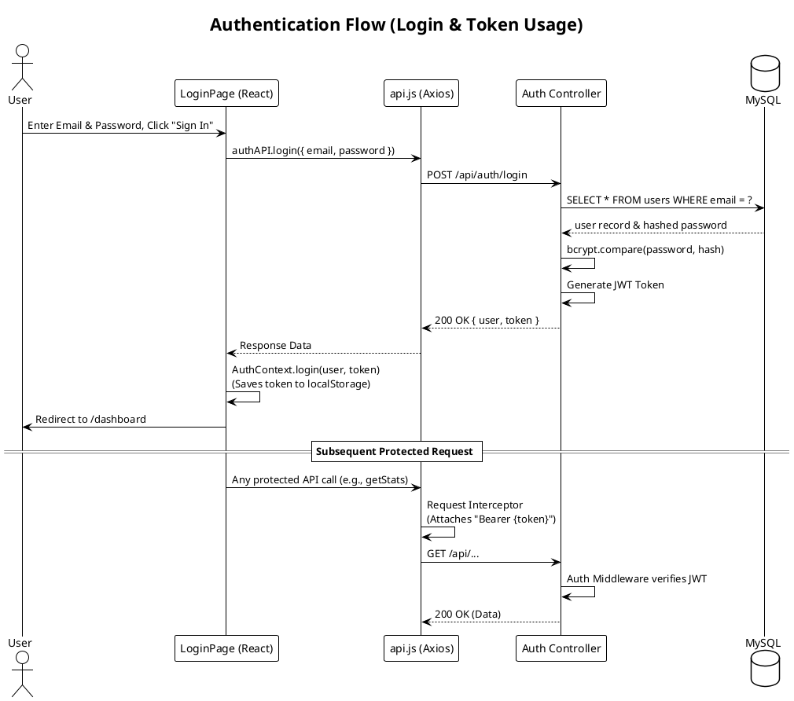
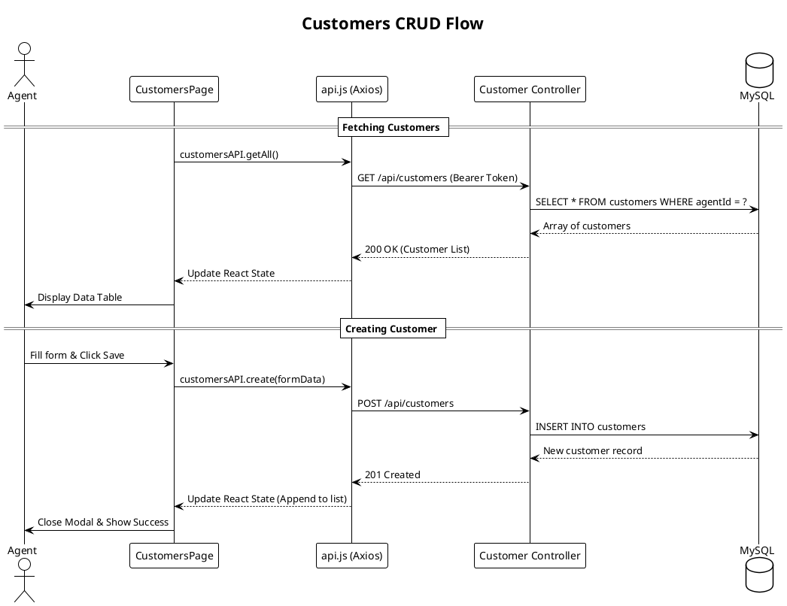
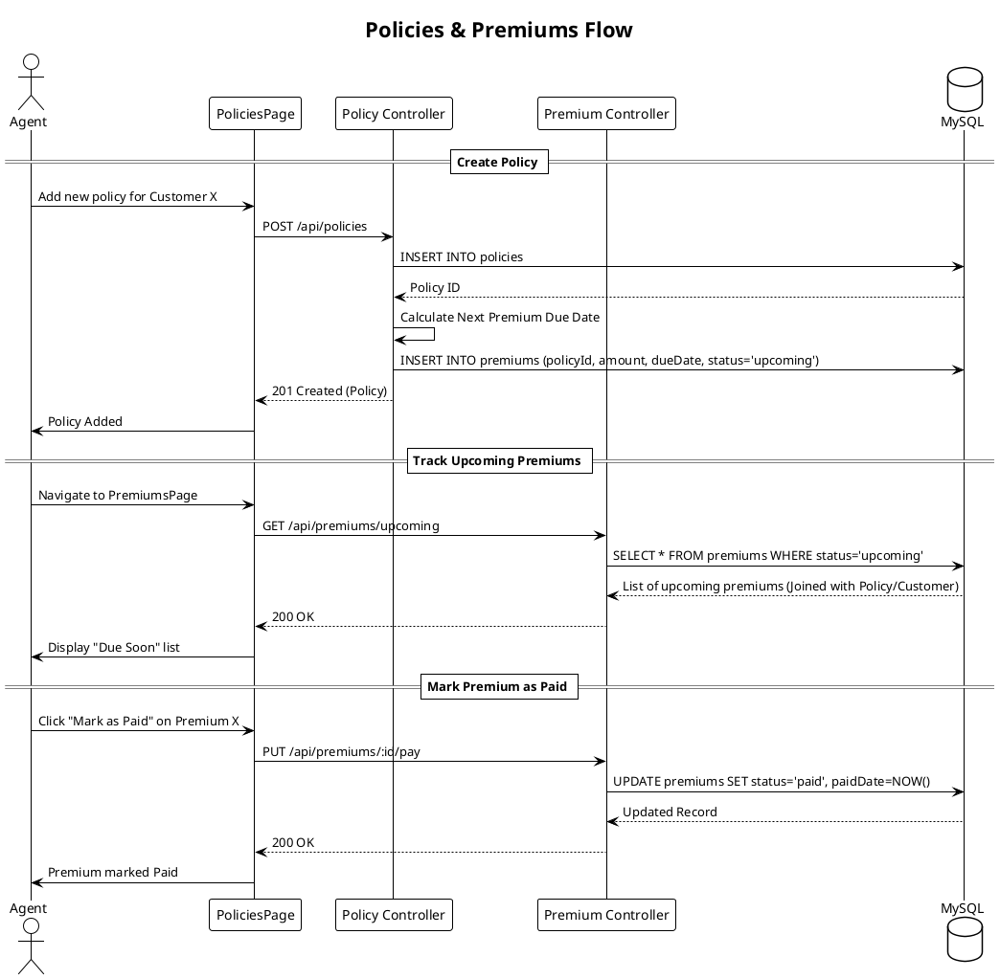
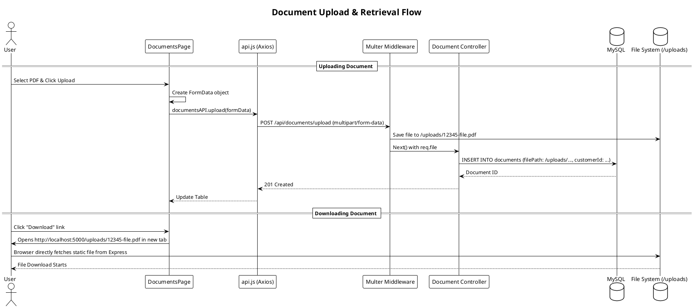
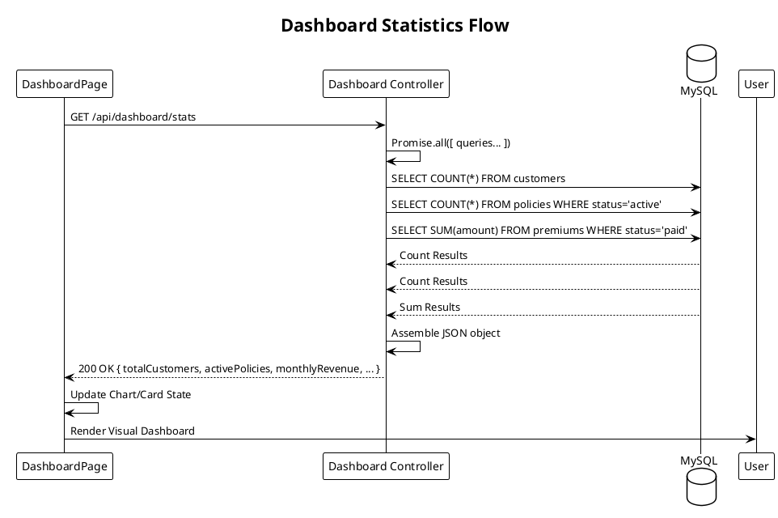

# SLM Insurance CRM - Detailed API Flows

Below are the detailed PlantUML sequence diagrams for every major interaction between the Frontend components, the Axios API client, the Express backend, and the MySQL database.

---

### 1. Authentication Flow (Login & Token)
This flow shows how a user logs in, receives a JWT token, and uses that token for subsequent protected requests.

---

### 2. Customers Management Flow (CRUD)
This flow outlines how agents create, read, update, and delete customer records.

---

### 3. Policies & Premiums Flow
This flow details how a policy is added to a customer, which automatically generates premium records.

---

### 4. Document Upload Flow
This flow describes the multipart form data process for uploading PDFs/Images using Multer.

---

### 5. Dashboard Aggregation Flow
This flow shows how the dashboard runs parallel aggregate queries to quickly compile metrics.

